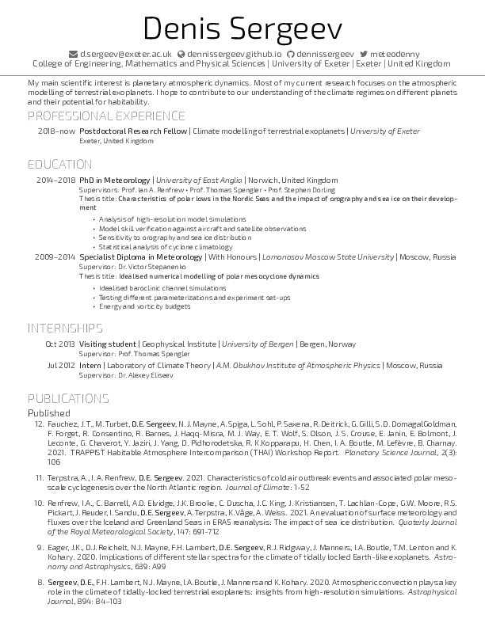

# My new CV rendered from a boilerplate

A boilerplate to ease the pain of building and maintaining a CV using LaTeX

More info: [cv-boilerplate](https://github.com/mrzool/cv-boilerplate)

LaTeX takes then care of the typesetting with its usual elegance. Below a preview of the final result. Check out the [output](output.pdf) to see the compiled PDF.

## Dependencies

1. LaTeX with the following extra packages: `fontspec` `geometry` `multicol` `xunicode` `xltxtra` `marginnote` `sectsty` `ulem` `hyperref` `polyglossia`
2. [Pandoc](http://pandoc.org/), the universal document converter.

**Note**: this template needs to be compiled with XeTeX.

## Available settings

- **`mainfont`**: Hoefler Text is the default, but every font installed on your system should work out of the box (thanks, XeTeX!)
- **`fontsize`**: Possible values here are 10pt, 11pt and 12pt.
- **`lang`**: Sets the main language through the `polyglossia` package. This is important for proper hyphenation, among other things.
- **`geometry`**: A string that sets the margins through `geometry`. Read [this](https://www.sharelatex.com/learn/Page_size_and_margins) to learn how this package works.

## Recommended readings

- [Typesetting Automation](http://mrzool.cc/writing/typesetting-automation/), my article about this project with in-depth instructions and some suggestions for an ideal workflow.
- [Why I do my résumé in LaTeX](http://www.toofishes.net/blog/why-i-do-my-resume-latex/) by Dan McGee
- [What are the benefits of writing resumes in TeX/LaTeX?](http://tex.stackexchange.com/questions/11955/what-are-the-benefits-of-writing-resumes-in-tex-latex) on TeX Stack Exchange
- [Typesetting your academic CV in LaTeX](http://nitens.org/taraborelli/cvtex) by Dario Taraborelli
- [Résumé advices](http://practicaltypography.com/resumes.html) from Butterick's Practical Typography 

## Resources

- Refer to [pandoc's documentation](http://pandoc.org/demo/example9/templates.html) to learn more about how templates work.
- If you're not familiar with the YAML syntax, [here](http://learnxinyminutes.com/docs/yaml/)'s a good overview.
- If you want to edit the template but LaTeX scares you, these [docs](https://www.sharelatex.com/learn/Main_Page) put together by ShareLaTeX cover most of the basics and are surprisingly kind to the beginner.
- Odds are your question already has an answer on [TeX Stack Exchange](https://www.sharelatex.com/learn/Main_Page). Also, pretty friendly crowd in there.

## License
License: [CC BY-SA 3.0](http://creativecommons.org/licenses/by-sa/3.0/)
